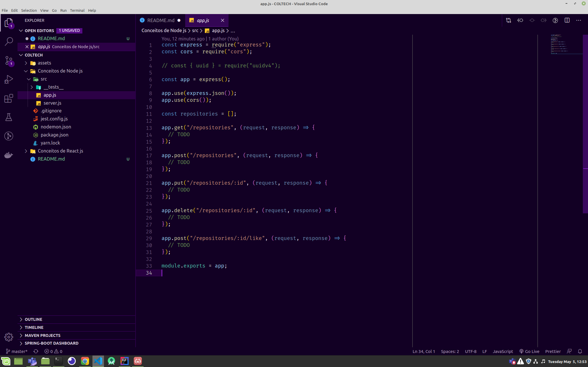

<h3 align="center">
   Conceitos do Node.js
</h3>

“Não espere para plantar, apenas tenha paciência para colher”!</blockquote>

  <a href="#rocket-sobre-o-desafio">Sobre o desafio</a>&nbsp;&nbsp;&nbsp;|&nbsp;&nbsp;&nbsp;
  <a href="#calendar-entrega">Entrega</a>&nbsp;&nbsp;&nbsp;|&nbsp;&nbsp;&nbsp;

## :rocket: Sobre o desafio

Nessa Atividade, você deve criar uma aplicação para treinar o que você aprendeu até agora no Node.js!

Essa será uma aplicação para armazenar repositórios do seu portfólio, que irá permitir a criação, listagem, atualização e remoção dos repositórios, e além disso permitir que os repositórios possam receber "likes".

### Template da aplicação

Para te ajudar nesse desafio, criamos para você um modelo que você deve utilizar como template ( obs: tem como colocar padrao no github).

Agora navegue até a pasta criada e abra no Visual Studio Code, lembre-se de executar o comando `yarn` no seu terminal para instalar todas as dependências, e você terá algo parecido com isso:

  

### Rotas da aplicação

Agora que você já está com o template clonado, e pronto para continuar, você deve abrir o arquivo app.js, e completar onde não possui código com o código para atingir os objetivos de cada rota.

- **`POST /repositories`**: A rota deve receber `title`, `url` e `techs` dentro do corpo da requisição, sendo a URL o link para o github desse repositório. Ao cadastrar um novo projeto, ele deve ser armazenado dentro de um objeto no seguinte formato: `{ id: "uuid", title: 'Desafio Node.js', url: 'http://github.com/...', techs: ["Node.js", "..."], likes: 0 }`; Certifique-se que o ID seja um UUID, e de sempre iniciar os likes como 0.

- **`GET /repositories`**: Rota que lista todos os repositórios;

- **`PUT /repositories/:id`**: A rota deve alterar apenas o `title`, a `url` e as `techs` do repositório que possua o `id` igual ao `id` presente nos parâmetros da rota;

- **`DELETE /repositories/:id`**: A rota deve deletar o repositório com o `id` presente nos parâmetros da rota;

- **`POST /repositories/:id/like`**: A rota deve aumentar o número de likes do repositório específico escolhido através do `id` presente nos parâmetros da rota, a cada chamada dessa rota, o número de likes deve ser aumentado em 1;

**Dica**: Acima utilizamos `POST` em uma rota, mesmo ela alterando o número de likes do repositório sem criar nada diretamente.

Se dividirmos semânticamente as responsabilidades da nossa aplicação em entidades, o `like` seria uma entidade, e `repository` seria outra entidade.

Com essa separação, temos diferentes regras de negócio para cada entidade, assim, ao chamar a rota de `like` e adicionamos apenas um like, podemos interpretar que estamos criando um novo like, e não atualizando os likes.

Então por que não usar `PUT` no lugar de `POST`? Justamente por estarmos "criando" UM novo like, e não atualizando o número de likes para qualquer outro valor.

Talvez fique difícil enxergar por ser apenas um número, mas pense que cada like seja salvo em uma tabela no banco junto do usuário que realizou esse like. Agora fica mais claro que você está criando um novo like, certo?

Bons estudos <3

<h3 align="center">
   Conceitos do ReactJS
</h3>

“Faça seu melhor, mas sempre com prazo de entrega”!</blockquote>

## :rocket: Sobre o desafio

Nesse desafio, você deve criar uma aplicação para treinar o que você aprendeu até agora no ReactJS!

Agora você deve continuar desenvolvendo a aplicação que irá armazenar repositórios do seu portfólio, que você já desenvolveu o backend no último desafio utilizando o Node.js.

### Template da aplicação

Para te ajudar nesse desafio, criamos para você um modelo que você deve utilizar como um template do Github.

Agora navegue até a pasta criada e abra no Visual Studio Code, execute o comando `yarn` no seu terminal para instalar todas as dependências e já estará pronto para iniciar.

### Funcionalidades da aplicação

Agora que você já está com o template clonado, e pronto para continuar, você deve abrir o arquivo **src/App.js**, e completar onde não possui código com o código para atingir os objetivos de cada funcionalidade.

- **`Listar os repositórios da sua API`**: Deve ser capaz de criar uma lista com o campo **title** de todos os repositórios que estão cadastrados na sua API.

- **`Adicionar um repositório a sua API`**: Deve ser capaz de adicionar um novo item na sua API através de um botão com o texto **Adicionar** e, após a criação, deve ser capaz de exibir o nome dele após o cadastro.

- **`Remover um repositório da sua API`**: Para cada item da sua lista, deve possuir um botão com o texto **Remover** que, ao clicar, irá chamar uma função para remover esse item da lista do seu frontend e da sua API.

## :calendar: Entrega

Esse desafio deve ser entregue ao JEDI da coltech.